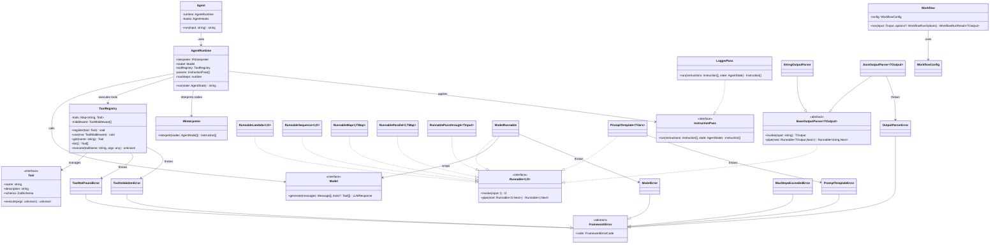

# Core Class Diagram

```mermaid
classDiagram

class Agent {
  -runtime: AgentRuntime
  -hooks: AgentHooks
  +run(input: string) string
}

class AgentRuntime {
  -interpreter: IRInterpreter
  -model: Model
  -toolRegistry: ToolRegistry
  -passes: InstructionPass[]
  -maxSteps: number
  +run(state: AgentState) string
}

class ToolRegistry {
  -tools: Map~string, Tool~
  -middleware: ToolMiddleware[]
  +register(tool: Tool) void
  +use(mw: ToolMiddleware) void
  +get(name: string) Tool
  +list() Tool[]
  +execute(toolName: string, args: any) unknown
}

class IRInterpreter {
  +interpret(nodes: AgentNode[]) Instruction[]
}

class Model {
  <<interface>>
  +generate(messages: Message[], tools?: Tool[]) LLMResponse
}

class InstructionPass {
  <<interface>>
  +run(instructions: Instruction[], state: AgentState) Instruction[]
}

class LoggerPass {
  +run(instructions: Instruction[], state: AgentState) Instruction[]
}

class Tool {
  <<interface>>
  +name: string
  +description: string
  +schema: ZodSchema
  +execute(args: unknown) unknown
}

class Runnable~I,O~ {
  <<interface>>
  +invoke(input: I) O
  +pipe(next: Runnable~O,Next~) Runnable~I,Next~
}

class RunnableLambda~I,O~
class RunnableSequence~I,O~
class RunnableMap~I,TMap~
class RunnableParallel~I,TMap~
class RunnablePassthrough~TInput~
class ModelRunnable

class PromptTemplate~TVars~

class BaseOutputParser~TOutput~ {
  <<abstract>>
  +invoke(input: string) TOutput
  +pipe(next: Runnable~TOutput,Next~) Runnable~string,Next~
}

class StringOutputParser
class JsonOutputParser~TOutput~

class Workflow {
  -config: WorkflowConfig
  +run(input: TInput, options?: WorkflowRunOptions) WorkflowRunResult~TOutput~
}

class FrameworkError {
  <<abstract>>
  +code: FrameworkErrorCode
}

class ToolNotFoundError
class ToolValidationError
class ModelError
class MaxStepsExceededError
class PromptTemplateError
class OutputParserError

Agent --> AgentRuntime : uses
AgentRuntime --> Model : calls
AgentRuntime --> ToolRegistry : executes tools
AgentRuntime --> IRInterpreter : interprets nodes
AgentRuntime --> InstructionPass : applies
LoggerPass ..|> InstructionPass

ToolRegistry --> Tool : manages
ToolRegistry --> ToolNotFoundError : throws
ToolRegistry --> ToolValidationError : throws

RunnableLambda ..|> Runnable
RunnableSequence ..|> Runnable
RunnableMap ..|> Runnable
RunnableParallel ..|> Runnable
RunnablePassthrough ..|> Runnable
ModelRunnable ..|> Runnable
ModelRunnable --> Model : wraps
ModelRunnable --> ModelError : throws

PromptTemplate ..|> Runnable
PromptTemplate --> PromptTemplateError : throws

BaseOutputParser ..|> Runnable
StringOutputParser --|> BaseOutputParser
JsonOutputParser --|> BaseOutputParser
JsonOutputParser --> OutputParserError : throws

Workflow --> WorkflowConfig : uses

ToolNotFoundError --|> FrameworkError
ToolValidationError --|> FrameworkError
ModelError --|> FrameworkError
MaxStepsExceededError --|> FrameworkError
PromptTemplateError --|> FrameworkError
OutputParserError --|> FrameworkError
```
