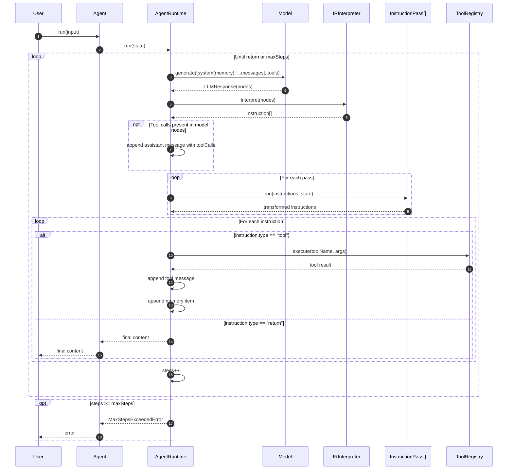

# Core Sequence Diagram

```mermaid
sequenceDiagram
  autonumber

  participant U as User
  participant A as Agent
  participant R as AgentRuntime
  participant M as Model
  participant I as IRInterpreter
  participant P as InstructionPass[]
  participant T as ToolRegistry

  U->>A: run(input)
  A->>R: run(state)

  loop Until return or maxSteps
    R->>M: generate([system(memory), ...messages], tools)
    M-->>R: LLMResponse(nodes)

    R->>I: interpret(nodes)
    I-->>R: Instruction[]

    opt Tool calls present in model nodes
      R->>R: append assistant message with toolCalls
    end

    loop For each pass
      R->>P: run(instructions, state)
      P-->>R: transformed instructions
    end

    loop For each instruction
      alt instruction.type == "tool"
        R->>T: execute(toolName, args)
        T-->>R: tool result
        R->>R: append tool message
        R->>R: append memory item
      else instruction.type == "return"
        R-->>A: final content
        A-->>U: final content
      end
    end

    R->>R: steps++
  end

  opt steps >= maxSteps
    R-->>A: MaxStepsExceededError
    A-->>U: error
  end
```
